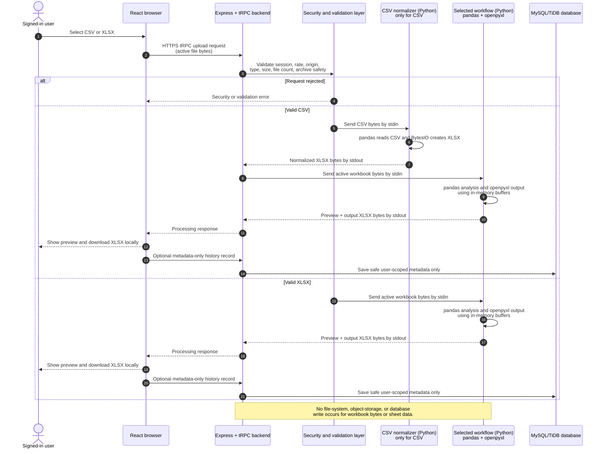

# Backend Upload-to-Output Processing Flow

## Direct Answer

When a user uploads an Excel file, the **data analysis runs on the backend server**, not in the browser and not inside the database. The backend starts a short-lived **Python 3 worker process** for the selected workflow. That worker uses **pandas** and **openpyxl** to read and transform the workbook from in-memory bytes, create a new XLSX workbook in memory, and send the result back to the TypeScript backend. The browser then displays the preview and lets the user download the output file.

> The application database is **not used to analyse the Excel file**. It stores only approved account information and metadata such as workflow name, output filename, totals, and completion time. It never stores spreadsheet cells, workbook bytes, preview rows, or generated XLSX content.

## 1. Where Each Part Runs

| Location | Technology | What happens there | Workbook data stored permanently? |
| --- | --- | --- | --- |
| User browser | React + TypeScript | User selects a CSV or XLSX file; the page sends the active upload request and later receives preview/download data. | No. The selected file and response exist only in browser memory during the active page session. |
| Backend API server | Node.js + TypeScript + Express + tRPC | Authenticates the request, validates upload limits/types, applies rate controls, chooses the requested workflow, starts Python worker processes, and returns the result. | No. It passes file payloads through request memory and process streams. |
| Python analysis worker | Python 3 + pandas + openpyxl | Reads workbook bytes, analyses sheets and columns, creates DataFrames, applies the workflow rules, and creates output XLSX bytes. | No. It uses `io.BytesIO` in memory, then exits after the workflow response. |
| Managed database | MySQL/TiDB + Drizzle ORM | Stores identity records, encrypted profile payloads, user settings, metadata-only process history, and safe audit events. | **Never** stores Excel file bytes, cell values, preview rows, or output workbooks. |

## 2. Step-by-Step Upload and Analysis Process

### Step 1 — User selects an allowed file in the browser

The workflow page permits only **CSV** and **XLSX** inputs. The browser holds the selected file temporarily and encodes it for the authenticated tRPC request. The browser does not send the file directly to the database.

### Step 2 — The request enters the Express backend

The React frontend sends the request to the `/api/trpc` backend endpoint over HTTPS. Before any Excel function runs, Express applies browser/API security controls including request-size limits, origin checks for supplied origins, restrictive headers, and no-store API responses.

### Step 3 — tRPC verifies the signed-in user and upload rate

The selected workflow uses a protected `uploadProcedure`. It first verifies the signed session and then applies the per-user, per-route upload limit: **12 upload-processing requests per minute**. A request that is not signed in or that exceeds the limit stops here; no Python analysis starts.

### Step 4 — The backend validates the upload payload

The TypeScript backend validates every file before it sends data to Python.

| Validation check | Current rule | Why it matters |
| --- | --- | --- |
| Allowed extension | `.csv` or `.xlsx` only | Blocks obsolete spreadsheet types and unrelated executable or archive formats. |
| Filename | Required, bounded, no unsafe path pattern | Prevents unsafe names from becoming part of the processing pipeline. |
| Per-file size | Maximum **10 MB** | Limits memory consumption per file. |
| Whole upload batch | Maximum **20 MB** and **10 files** | Limits combined request volume. |
| CSV check | Rejects binary/NUL-character data | Keeps CSV processing text-based. |
| XLSX check | Requires ZIP/XLSX markers and safe archive count/expansion limits | Reduces archive-abuse risk before spreadsheet libraries read it. |

If validation fails, the backend returns an error to the browser. The worker does not start, and no workbook is saved.

### Step 5 — CSV input is normalized only when needed

All existing Excel workflow processors work with an Excel-style workbook. For a valid CSV input, the Node.js backend starts `scripts/normalize_upload.py` as a temporary child process.

1. Node sends the accepted base64 CSV payload to the Python worker through **standard input**.
2. Python decodes the bytes, reads the CSV with pandas, and writes an XLSX file to a Python `BytesIO` memory buffer using openpyxl.
3. Python returns normalized XLSX bytes, encoded as base64 JSON, through **standard output**.
4. Node keeps the normalized payload in request memory and passes it to the selected workbook workflow.

No temporary upload folder, object-storage bucket, or database record is used for this conversion.

### Step 6 — The backend starts the selected Python workflow processor

For every workflow—such as Master Consolidation, Deletion Summary, Duplicate Separation, Addition & Exit Match, Onboard Check, Ready File, or Facility by Facility—the TypeScript router starts the relevant Python worker using `python3`. The full active input payload is sent as JSON through the worker’s standard input. The worker’s standard output is reserved for the result JSON, and standard error is used only when the worker fails.

### Step 7 — Python performs the data analysis in memory

The Python worker decodes each base64 workbook into a `bytes` value and opens it with memory buffers such as `io.BytesIO(content)`. pandas reads the data into DataFrames and applies the required workflow rules.

For example, the **Master Consolidation** workflow does the following:

1. Opens the uploaded workbook with `pd.ExcelFile(io.BytesIO(content))`.
2. Finds worksheets whose names indicate Addition or Deletion.
3. Reads matching worksheets into pandas DataFrames.
4. Adds `Source_File` metadata to each data row.
5. Combines Addition rows and Deletion rows across the active files.
6. Creates a summary DataFrame with per-file counts and the `TOTAL` row.
7. Creates a replacement `Master_Combined_With_Summary.xlsx` workbook in a `BytesIO` buffer with `Summary Report`, `Addition`, and `Deletion` sheets.
8. Builds a limited preview response from DataFrame heads—not from a database query.

All eight workflows follow this same high-level design: **read active input bytes → process with pandas/openpyxl in memory → create output bytes → return response**. pandas provides table-oriented DataFrames, while openpyxl writes XLSX workbooks.[1] [2]

### Step 8 — Python returns the output to the Node.js backend

The Python worker returns one JSON response over standard output. It includes safe result information such as output filename, counts, sheet names, workflow errors, limited preview values, and a base64-encoded `workbookBase64` output value.

The Node.js wrapper parses that JSON. If the worker exits with an error code or produces incomplete output, the backend returns a processing error to the browser. It does not retry by storing the uploaded file.

### Step 9 — Browser receives preview and output bytes

The React workflow page receives the processing response. It presents the summary and limited previews so the user can review the result. The `workbookBase64` output is kept only in the active browser state until the user selects download.

### Step 10 — User downloads the generated XLSX

The browser converts the response bytes into a local file download. The generated XLSX goes to the user’s device. The backend does not place it in application storage after completing the response.

### Step 11 — Optional metadata-only process history is recorded

After a successful workflow, the client can call a separate protected history-record API. That API stores only the following metadata for the signed-in user: tool key/name, completed status, input **file names**, output filename, safe total-record count, and completion timestamp.

It does **not** store the input workbook, worksheet contents, preview rows, output workbook, raw IP address, session token, or profile-field values.

## 3. Focused Backend Sequence Diagram

## 4. What Is Temporary and What Is Persisted

| Data item | Location during use | Persisted after the request? |
| --- | --- | --- |
| Uploaded CSV/XLSX bytes | Browser memory, HTTPS request, Node.js memory, Python standard-input stream, Python `BytesIO` buffer | **No** |
| Parsed worksheet values / pandas DataFrames | Python worker memory only | **No** |
| Preview rows | Python response, Node response, browser page state | **No** |
| Generated XLSX output bytes | Python `BytesIO`, JSON response, browser state/download | **No** |
| Selected file name and output name | Optionally metadata-only process history | **Yes, if the user’s history is recorded** |
| Safe record totals and completion time | Optional metadata-only process history | **Yes, if the user’s history is recorded** |
| Profile details | Encrypted payload in user profile table | **Yes, encrypted** |

## 5. If the Backend or Browser Stops

Because the workbook pipeline is deliberately in-memory, an incomplete upload or processing request has no stored workbook to resume. The user simply uploads the file again. This is a privacy-first design choice: it avoids retaining Excel data after the request ends.

## References

[1] [pandas documentation](https://pandas.pydata.org/docs/)

[2] [openpyxl documentation](https://openpyxl.readthedocs.io/)
