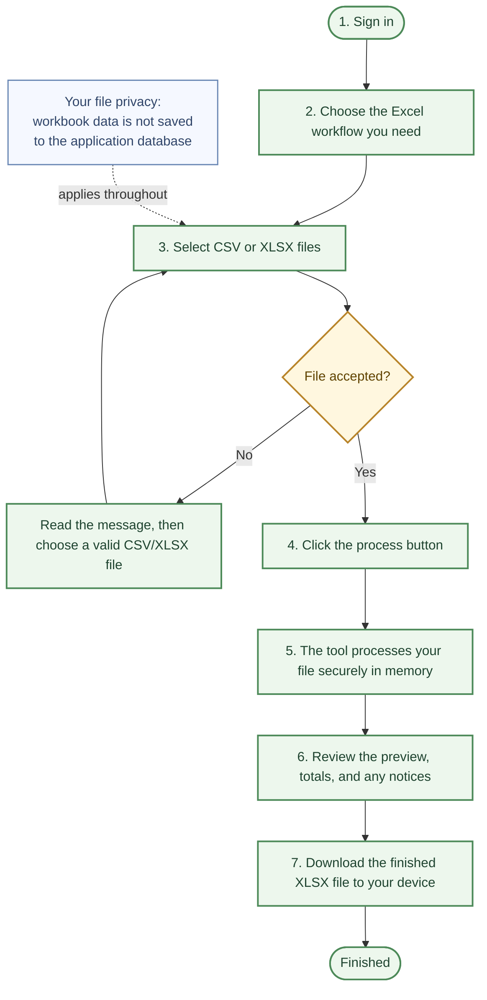

# Excel Master File Tool: Simple User Journey

## What This Tool Does

The Excel Master File Tool helps you turn an approved **CSV** or **XLSX** file into a new Excel result. Each workflow has its own page and produces a preview before you download the finished workbook.

> Your file is used only for the current processing request. The application analyses it securely in memory, sends the preview and result back to your browser, and does not keep the workbook, spreadsheet rows, or generated Excel file in its database.

## Simple Journey Diagram

## Step-by-Step Instructions

| Step | What you do | What the tool does |
| --- | --- | --- |
| **1. Sign in** | Sign in with your account. | Confirms that the work area and your optional process history belong only to you. |
| **2. Choose a workflow** | Select the required function from the left menu. For example, choose **Master consolidation**, **Deletion summary list**, **Duplicate separation**, or **Facility by facility**. | Opens the correct upload page for that Excel task. |
| **3. Select your file** | Choose the requested one or more files. Use **CSV** or **XLSX** only. | Checks file type, name, size, file count, and workbook safety before processing starts. |
| **4. Start processing** | Click the main button, such as **Merge and preview**, **Build summary list**, or **Convert file**. | Reads the active file in memory and runs the selected analysis. |
| **5. Wait for the result** | Keep the page open while the result is prepared. | Creates a new Excel workbook and limited preview in memory. Your source workbook is not saved in the application database. |
| **6. Review the preview** | Check counts, tabs, sample rows, and any notices. If the result is not correct, adjust the source file and run it again. | Shows the generated summary and preview before any download is made. |
| **7. Download the result** | Click the download button. | Sends the finished `.xlsx` file to your device. |

## Which Workflow Should I Choose?

| Your task | Select this menu item |
| --- | --- |
| Merge Addition and Deletion information from multiple workbooks | **Master consolidation** |
| Count deletion records by entity | **Deletion summary list** |
| Separate repeated employee name and NRC combinations | **Duplicate separation** |
| Create entity totals across all sheets in one workbook | **Deletion with summary** |
| Match exit records with original Addition data | **Addition & exit match** |
| Check deletion NRC values against onboarding data | **Deletion & onboard check** |
| Convert employee data into the required final upload format | **Ready file to upload** |
| Create one worksheet per facility/entity and a summary | **Facility by facility** |

## If Something Goes Wrong

| What you see | What to do next |
| --- | --- |
| **File type or validation message** | Use a CSV or XLSX file, check that the file is not damaged, and confirm it is within the allowed upload size. |
| **Missing sheet or column notice** | Review the notice. Rename or add the expected sheet/column in your source workbook, then process it again. |
| **No result yet** | Wait for the page to finish. Do not close or refresh the page while processing. |
| **Result needs correction** | Update your original file and run the selected workflow again. The prior workbook was not saved by the application. |
| **Need a copy of your account metadata** | Open **Account management** to export your profile and saved process-history metadata. This export does not contain workbook data. |

## What Is Kept and What Is Not

| Data | Kept after processing? |
| --- | --- |
| Uploaded CSV/XLSX file and its spreadsheet cells | **No** |
| Preview rows and generated Excel workbook | **No** |
| Downloaded result on your own computer | **Yes—on your device only** |
| Optional process history | **Yes—metadata only:** tool name, file-name metadata, output name, safe totals, and time |
| Editable profile details | **Yes—encrypted in your user profile** |
