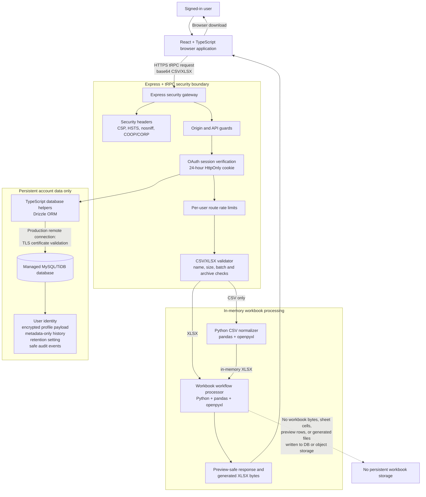

# Excel Master File Tool: Technical Architecture

## Purpose

This document describes the **implemented architecture** of the Excel Master File Tool. It explains which programming languages and frameworks are used, how the frontend and backend communicate, what is stored in the database, and—most importantly—how uploaded CSV and XLSX workbooks are processed without being saved as spreadsheet data in the application database or object storage.

> **Privacy boundary:** source workbooks, worksheet rows, previews, and generated workbook bytes exist only in the active request-processing path and are returned to the signed-in browser for download. They are not stored as application records.

## 1. Technology Stack

| Layer | Programming language | Main technologies | Responsibility |
| --- | --- | --- | --- |
| Browser frontend | TypeScript | React 19, Vite, Tailwind CSS 4, TanStack React Query, tRPC client | Provides the dashboard, separate workflow screens, file selection, in-browser previews, account controls, and downloads. |
| API and security layer | TypeScript / Node.js | Express 4, tRPC 11, Zod, JOSE | Receives authenticated API calls, applies security headers and request checks, validates input contracts, and dispatches workflow processing. |
| Workbook-processing layer | Python 3 | pandas, openpyxl | Performs the spreadsheet transformations and produces XLSX output entirely from in-memory byte streams. |
| Database access layer | TypeScript | Drizzle ORM, mysql2 | Accesses the managed MySQL/TiDB-compatible database using parameterized ORM operations and production TLS settings. |
| Relational database | SQL | MySQL/TiDB-compatible managed database | Stores user identity, encrypted editable profile payloads, metadata-only process history, retention preferences, and privacy-safe audit events. |
| Identity and session layer | TypeScript / OAuth 2.0 | Manus OAuth, signed JWT session, secure cookie | Authenticates a user, issues a 24-hour session, and provides the signed-in user to protected API procedures. |

React supplies the browser component model; Express provides the HTTP server layer; tRPC gives the frontend and backend a type-safe API contract; and pandas/openpyxl provide Excel-oriented tabular processing.[1] [2] [3] [4]

## 2. Frontend Structure

The frontend is a **React + TypeScript dashboard**. It uses a persistent sidebar with a separate route for each Excel workflow, rather than placing all tools on one page. Each workflow page uses an input picker restricted to `.csv` and `.xlsx`, sends base64-encoded file data through the authenticated tRPC API, shows a response preview, and allows download only after processing succeeds.

| Frontend area | What it does | Data it receives or retains |
| --- | --- | --- |
| Workflow pages | Collect one or more approved files and show output preview/download controls. | Temporary browser state for the selected file and current response only. |
| Dashboard | Shows completed-run counts and recent metadata. | Tool name, status, file name metadata, safe totals, output name, completion time. |
| Profile panel | Lets a signed-in user edit personal profile details. | Profile data fetched through a protected API call. |
| Account Management | Exports or deletes a user’s account data; sets metadata-retention periods. | User-scoped identity, encrypted-profile values after server decryption, and metadata-only history. |

The frontend **does not connect directly to the database** and does not receive database credentials. It uses the typed tRPC client over the `/api/trpc` route.

## 3. Backend Structure

The backend is an **Express + tRPC application written in TypeScript**. Express starts the HTTP server, applies cross-cutting middleware, and serves the frontend application. tRPC defines the protected procedures used by the React client. Zod validates request shapes before a workflow function receives data.[2] [3] [5]

| Backend module | Responsibility |
| --- | --- |
| Express entry point | Enables proxy awareness, disables framework identification, adds security headers, limits JSON request bodies to 25 MB, installs API guards, registers OAuth, and mounts tRPC. |
| Authentication context | Reads the signed session from a secure cookie, verifies it, synchronizes authenticated user identity, and makes the user available to protected procedures. |
| `uploadProcedure` | Requires sign-in and limits upload-processing requests to **12 per user per minute per API path**. |
| `sensitiveProcedure` | Requires sign-in and limits profile/history changes to **30 per user per minute per API path**. |
| Upload validation | Accepts only CSV or XLSX names and content patterns; applies 10 MB per-file, 20 MB batch, and 10-file limits; performs XLSX archive-safety checks. |
| Python worker bridge | Converts accepted CSV data to an in-memory XLSX payload when needed, then sends normalized data to the existing workbook processors. |
| Workbook processors | Run the eight Excel workflows and return preview-safe result metadata plus output workbook bytes to the API response. |
| Database helpers | Apply user-id scoping, profile encryption/decryption, metadata retention, and privacy-safe audit-event creation. |

## 4. Authentication and Session Flow

1. The user selects **Sign in** in the React application.
2. The browser is redirected through the OAuth authorization flow.
3. The backend validates the OAuth callback and synchronizes the user identity record.
4. The backend issues a signed session token in a cookie configured as **HttpOnly**, **SameSite=Lax**, and **Secure** when HTTPS is active.
5. The session lifetime is **24 hours**. For protected tRPC calls, the backend loads the user into the request context.
6. The API rejects unauthenticated protected requests before they reach an Excel workflow or user-owned database operation.

## 5. Secure CSV/XLSX Processing Flow

The diagram below shows the full data path. The red dashed boundary identifies data that is deliberately **not persisted**.

**Diagram verification:** the delivered PNG was rendered from the Mermaid source using the same vertical grouping shown above. It separates the browser, Express/tRPC security boundary, in-memory workbook worker, and persistent account-data layer so the privacy boundary can be reviewed without relying on the diagram alone.

## 6. Database Data Model

The database deliberately separates long-lived account information from temporary workbook processing. The processor itself does not insert spreadsheet rows, workbook bytes, previews, or generated Excel files into any database table.

| Table | Stored information | Explicitly excluded |
| --- | --- | --- |
| `users` | OAuth identity reference, name/email supplied by the identity provider, role, sign-in timestamps. | Passwords and uploaded workbook data. |
| `user_profiles` | One AES-256-GCM encrypted JSON payload containing editable profile information. | Plaintext editable profile values. |
| `process_history` | Tool name/key, completion status, source file-name metadata, output name metadata, record total, completion time. | Workbook bytes, cells, sheet content, preview rows, or generated output bytes. |
| `user_process_settings` | The user’s metadata-retention preference. | Any workbook content. |
| `security_audit_events` | User id, safe event type, limited sanitized metadata, timestamp. | Raw IP addresses, tokens, file names, spreadsheet content, profile values, or secrets. |

The database layer uses Drizzle ORM with MySQL-compatible connections. In production, non-local database connections are configured with a bounded connection pool, a connection timeout, keep-alive, and TLS certificate verification; invalid or missing production database configuration fails closed rather than silently selecting an insecure fallback.[6] [7]

## 7. Security Controls at Each Boundary

| Boundary | Controls currently implemented |
| --- | --- |
| Browser to server | HTTPS-aware secure session cookie; Content Security Policy; HSTS on HTTPS; `nosniff`; referrer, permissions, cross-origin opener, and cross-origin resource policies. |
| API request | Request size limit, mutation origin validation when an Origin header is supplied, generic error responses, API `Cache-Control: no-store`. |
| Authenticated operation | Protected tRPC procedures; user-id scoping; per-route in-memory rate limits for upload and sensitive operations. |
| File intake | CSV/XLSX only; filename rules; file/batch/count limits; CSV binary checks; XLSX archive/content-marker and archive-expansion checks. |
| Processing | Python byte-stream processing and in-memory CSV normalization; no workbook object is stored in application tables or storage. |
| Database | ORM-based operations, user-scoped queries, encrypted profile payloads, production TLS certificate validation, bounded connections, redacted initialization errors. |
| Auditability | User-scoped security events that record operational event types and only allowlisted safe metadata. |
| Dependency management | Production dependency audit script, executed as part of the security verification process. |

## 8. Operational Notes and Future Scaling

The current rate limiter is intentionally lightweight and runs in application memory. This is suitable for a single running instance and provides a first layer of protection. If the application is later deployed to multiple simultaneously active instances, move rate-limit counters to a shared durable store or platform-level gateway so all instances enforce the same limit.

For a future high-volume deployment, consider asynchronous queued processing with encrypted, short-lived storage only if the business requirement changes. That would require a separate privacy review because the current design’s strongest privacy property is the absence of persisted workbook content.

## References

[1] [React documentation](https://react.dev/learn)

[2] [Express documentation](https://expressjs.com/)

[3] [tRPC documentation](https://trpc.io/docs)

[4] [pandas documentation](https://pandas.pydata.org/docs/); [openpyxl documentation](https://openpyxl.readthedocs.io/)

[5] [Zod documentation](https://zod.dev/)

[6] [Drizzle ORM MySQL documentation](https://orm.drizzle.team/docs/get-started-mysql)

[7] [mysql2 SSL connection options](https://sidorares.github.io/node-mysql2/docs/documentation/ssl)
